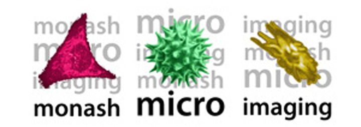

# BioInfoSummer: Image Analysis with Fiji/ImageJ

## Presenters
<table>
<tr>
<td><b>Dr Richard Beare</b> Stroke and Ageing Research Group (STAR) Department of Medicine at Monash Medical Centre Email: <a href="mailto:richard.beare@monash.edu">richard.beare@monash.edu</a></td>
<td><b>Dr Keith Schulze</b> Monash Micro Imaging Email: <a href="mailto:keith.schulze@monash.edu">keith.schulze@monash.edu</a></td>
</tr>
</table>

## Acknowledgements
**Cameron Nowell**

Much of the material from this series comes from the excellent Fiji/ImageJ workshop that is run by Cameron Nowell, Monash Institute of Pharmaceutical Sciences. 

### Image Contributors

| Name | Image | Affiliation |
| :--- | :---- | :---- |
| Alasdair Wood | Zebrafish confocal | Currie Lab, Australian Regenerative Medicine Institute, Monash Unveristy |
| Cameron Nowell | Live Wound Assay | Ludwig Institute |
| Richard Young | Fluorescence Meaurement | Peter MacCallum Cancer Centre |
| Steve Williams |  Cell segmentation and cell scoring | Peter MacCallum Cancer Centre |

 

<table>
<tr>
<td></td>
<td></td>
<td></td>
<td></td>
</tr>
</table>