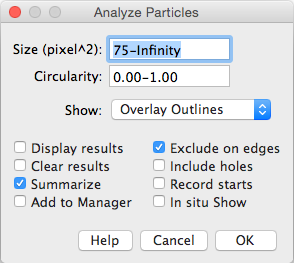

# Example: Automate cell scoring

First, let's get the open image from ImageJ and split the channels into 3 separate images. 

```python
from ij import IJ, ImagePlus
from ij.plugin import ChannelSplitter
from ij.measure import ResultsTable
from ij.plugin import ChannelSplitter
from ij.plugin.filter import ParticleAnalyzer
from ij.process import AutoThresholder
from java.lang import Double

# Get the currently open image
img = IJ.getImage()
title = img.getTitle()

# Split the channels
channels = ChannelSplitter.split(img)
dapi = channels[0]
ki67 = channels[1]
ph3 = channels[2]
dapi.show()
ki67.show()
ph3.show()
```

---
Next, let's automate the different steps in scoring the number of cell expressing different markers.

Segment the DAPI channel by threshold and run watershed to split touching cells.

```python
dapi.getProcessor().setAutoThreshold(AutoThresholder.Method.Li)
IJ.run(dapi, "Convert to Mask", "")
IJ.run(dapi, "Watershed", "")
```

---
Segment Ki67 Channel:

```python
ki67.getProcessor().setAutoThreshold(AutoThresholder.Method.Li)
IJ.run(ki67, "Convert to Mask", "")
```
Segmenting the Ph3 channel (not shown here) is the same process.

---
Now let's quantify the number of cells in each channel using Particle Analysis (i.e., Connected Components). To do this we use the ParticleAnalyzer plugin from ImageJ.

```python
rt = ResultsTable()
pa = ParticleAnalyzer(ParticleAnalyzer.EXCLUDE_EDGE_PARTICLES |
                          		 ParticleAnalyzer.SHOW_MASKS,
                          		 ParticleAnalyzer.AREA, rt, 75, 
                          		 Double.POSITIVE_INFINITY)
pa.analyze(dapi)
pa.analyze(ki67)
pa.analyze(ph3)
rt.show("Results")
```


