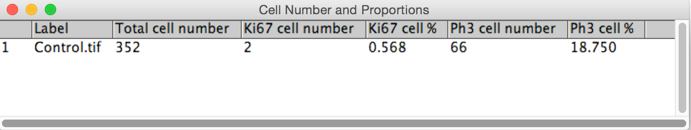

# Phase 4: Make the results look pretty
The number of cells for each channel are output as a different line in the table. It would be better if the number and proportion of cells expressing markers could be output as a single row in the table for each image.



---
Define a function to count the number of cells in a binary image using the ParticleAnalyzer and return just the number.

```python
def count_cells(img, min_size=0, max_size=Double.POSITIVE_INFINITY):
    """Counts cells in a binary image.
    :param img input binary image
    :type img ImagePlus
    :param min_size minimum cell size
    :type min_size float
    :param max_size maximum cell size
    :type max_size float
    :param min_circ min cell circularity
    :type min_circ float
    :param max_circ maximum cell circularity
    :type max_circ float
    :return number of cells
    """
    # Define a results table to store results for each particle
    rt = ResultsTable()
    pa = ParticleAnalyzer(ParticleAnalyzer.EXCLUDE_EDGE_PARTICLES |
                          ParticleAnalyzer.SHOW_NONE,
                          ParticleAnalyzer.AREA, rt, min_size, max_size)
    pa.setHideOutputImage(True)
    pa.analyze(img)

    # Hack to get the number of cells - count the number of rows in the 
    # first column.
    return len(rt.getColumn(0))
```

---
Use our function to count number of cells in each channel.

```python
# Count number of cells in each image
dapi_cell_num = count_cells(dapi, min_size=75)
ki67_cell_num = count_cells(ki67, min_size=75)
ph3_cell_num = count_cells(ph3, min_size=75)
```

---
Calculate the percentage of cells expressing Ki67 and Ph3.

```python
# Calculate proportion of total cells that express marker
ki67_cell_prop = float(ki67_cell_num) / float(dapi_cell_num) * 100
ph3_cell_prop = float(ph3_cell_num) / float(dapi_cell_num) * 100
```

---
Okay, let's tabulate the results using an ImageJ [ResultsTable](http://rsb.info.nih.gov/ij/developer/api/ij/measure/ResultsTable.html).

```python
# Tabulate the results
results = ResultsTable()
results.incrementCounter()
results.addLabel(title)
results.addValue("Total cell number", dapi_cell_num)
results.addValue("Ki67 cell number", ki67_cell_num)
results.addValue("Ki67 cell %", ki67_cell_prop)
results.addValue("Ph3 cell number", ph3_cell_num)
results.addValue("Ph3 cell %", ph3_cell_prop)
results.show("Cell Number and Proportions")
```