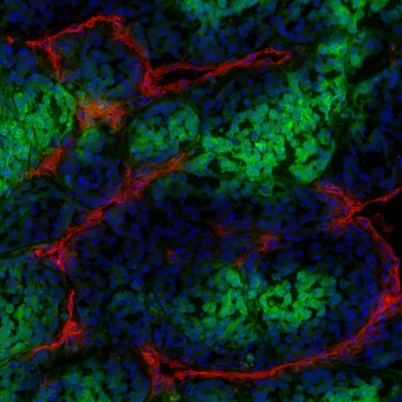
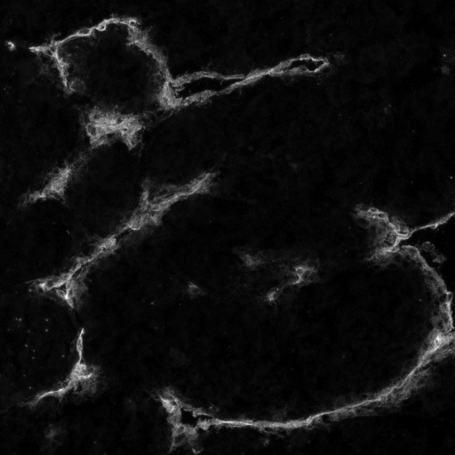
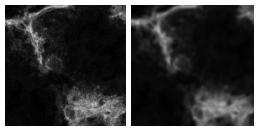
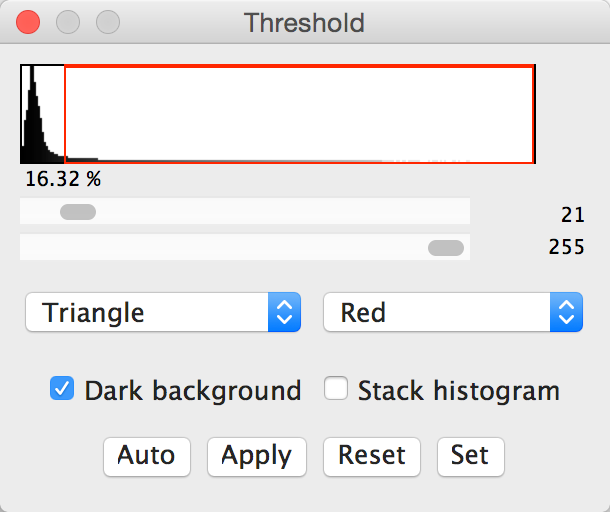
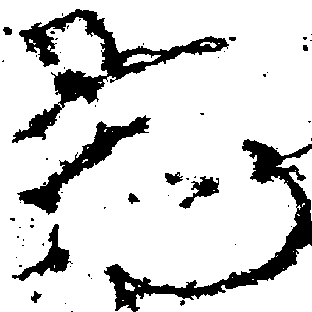
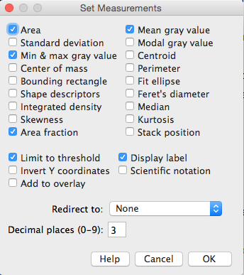
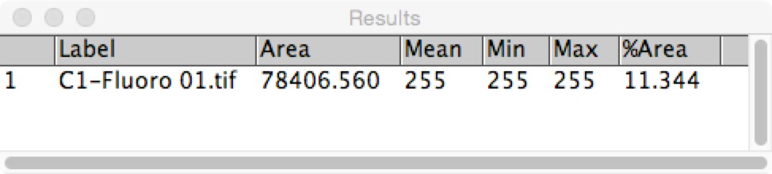

# Example 1: Fluorescent stain measurement
Fluorescent wide field image of three fluorescent markers/stains:

* Blue: DAPI nuclear marker
* Red: Marker for wounding
* Green: Cytoplasmic marker for healthy cells.



---

## Aim
Analyse the area covered and/or intensity of marker for wounding. 

<p>1. Open "[...]/Images/Widefield/Fluorescence Measurement/Fluoro 01.tif"</p>
<br>
<p>2. Calibrate the image:</p>

```
Image → Properties
Unit of length: µm
Pixel width: 0.6
Pixel height: 0.6
Voxel depth: 1
```

Calibration are usually encoded in the image metadata in modern microscopes 

<br>
<p>3. Split channels so we can do measurements on a specific channel.</p>

`Image → Colour → Split Channels`



---

## Filtering

<p>4. Apply a Gaussian Blur with a sigma of 1 px to reduce noise.</p>

`Process → Filters → Gaussian Blur...`

A Gaussian blur filter helps to smooth noise that is typically present in images acquired with highly sensitive camera sensors or detectors.



---

## Segmentation

<p>5. Threshold based segmentation:</p>

`Image → Adjust → Threshold...`



Thresholding segments the images based on pixel intensity. Thresholds can be set manually or automatically via algorithms that examine the image histogram.



---

## Measurement

<p>6. Set measurement types:</p>

```
Analyze → Set Measurements...
Tick: Area, Min & max grey value, Mean grey value, Area Fraction, Limit to Threshold, Display label 
```



<br>
<p>7. Measure:</p>

` Analyze → Measure`

Here we are measuring the cumulative area of all stained parts. In the next example, we will utilise connected components to analyse the characteristics of individual segmented regions.



