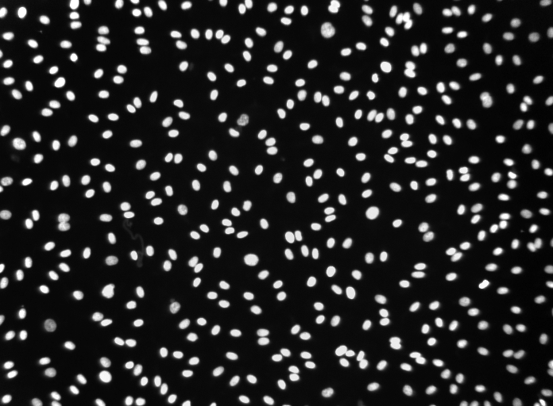

# Example 2: Counting cells



## Aim
Count the number of cells in an image

<p>1. Open image "[...]/images/Widefield/Cell Segmentation/Nuclei.tif"</p>
<br>
<p>2. Segment by thresholding:</p>

```
Image → Adjust → Threshold
Li auto-thresholding method
```


Some nuclei are touching one another. Obviously this will skew the results. A "Watershed" binary morphology filter is able to split touching objects and it works particularly well for ellipsoid shapes.

<br>
<p>3. Split touching cell using watershed.</p>

`Process → Binary → Watershed`


<br>
<p>4. Use Connected Components (or Particle Analysis in the ImageJ world) to count number of cells and extract cellular parameters.</p>

`Analyze →  Analyze Particles...`


Note: Filtering the output is really useful. For instance, setting a small size filter can help to exclude tiny speckles that might arise from noisy 'bright' pixels that exceed the threshold.


