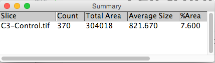

# Cell scoring
Extension of the previous demo. Widefield fluorescent images where cells are expressing markers for proliferation (green) and death (red).

## Aim
Determine the proportion of total cells that express different markers.

<p>1. Open image: "[...]/Images/Widefield/Cell Scoring and Cycle/Control.tif"</p>


<p>2. Split the channels so we can work on them individually</p>

`Image → Color → Split Channels`


# Determine total cell number

<p>3. Segment the DAPI (blue) channel by thresholding.</p>

```
Image → Adjust → Threshold...
Select "Li" AutoThreshold method.
```

<p>4. Split touching cells with a Watershed binary morphological filter.</p>

`Process → Binary → Watershed`

<p>5. Use connected components (or Particle Analysis in the ImageJ world) to count number of cells</p>

`Analyze → Analyze Particles...`


