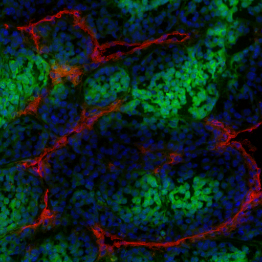
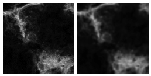
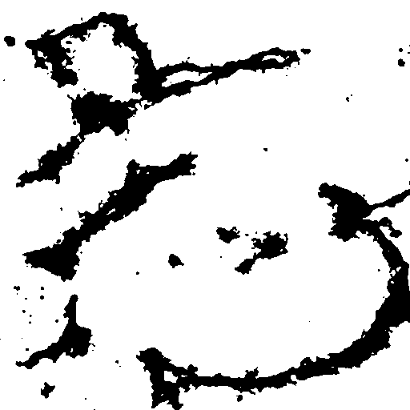
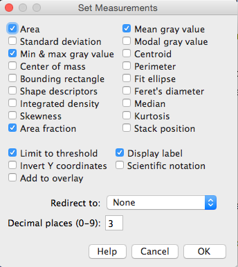
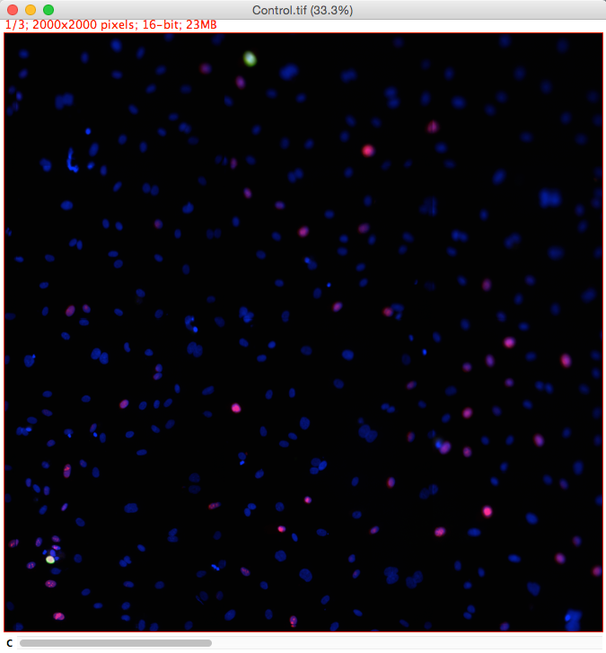
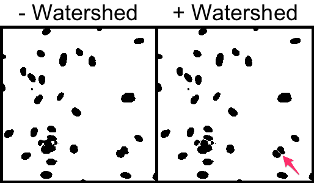
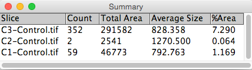

# What is ImageJ?

* Opensource image analysis software
* Provides a base set of tools and libraries for interactive and programmatic image analysis
* Powerful plugin system for extending ImageJ's functionality


---
# What is Fiji?
Short version: **F**iji **I**s **J**ust **I**mageJ

Long version: Fiji is an extension of the ImageJ core/base and it comes bundled with a whole bunch of useful plugins and goodies. It's a really good place to start with ImageJ.


---


# Opening & Interacting with multi-dimensional images
ImageJ/Fiji Hyperstacks let you to view multi-dimensional images: 

- X, Y 
- Z 
- Channels (Colours)
- Time

---
# Tools

All the usaul suspect and more:

- Navigation (Zoom, Pan)
- Transformations (Duplicate, Crop, Scale, Rotate)
- Regions Of Interest (ROI)

---
# Image Calibration
Relating image units to physical units i.e., what size does each pixel represent in metric units.

Calibration are usually encoded in the image metadata in modern microscopes, but images for older microscopes need to be calibrated. 

---

# Example 1: Fluorescent stain measurement
Fluorescent wide field image of three fluorescent markers/stains:

* Blue: DAPI nuclear marker
* Red: Marker for wounding
* Green: Cytoplasmic marker for healthy cells.



---

## Aim
Analyse the area covered and/or intensity of marker for wounding. 

Open:
`"[...]/Images/Widefield/Fluorescence Measurement/Fluoro 01.tif"`

Calibrate the image:

```
Image → Properties
Unit of length: µm
Pixel width: 0.6
Pixel height: 0.6
Voxel depth: 1
```


---

## Split channels
Split channels so we can do measurements on a specific channel.

`Image → Colour → Split Channels`


---

## Filtering

Apply a Gaussian Blur with a sigma of 1 px to reduce noise.

`Process → Filters → Gaussian Blur...`

A Gaussian blur filter helps to smooth noise that is typically present in images acquired with highly sensitive camera sensors or detectors.



---

## Segmentation

Threshold based segmentation:

`Image → Adjust → Threshold...`

Thresholding segments the images based on pixel intensity. Thresholds can be set manually or automatically via algorithms that examine the image histogram.



---

## Set measurement types

```
Analyze → Set Measurements...
```



---

## Measuring

` Analyze → Measure`

Here we measure the cumulative area of all stained parts. In the next example, we will utilise connected components to analyse the characteristics of individual segmented regions.


---

# Example 2: Counting cells


---

## Aim
Count the number of cells in an image

Open: 
`"[...]/images/Widefield/Cell Segmentation/Nuclei.tif"`

---

## Segment by thresholding

```
Image → Adjust → Threshold
Li auto-thresholding method
```


---

## Watershed
Some nuclei are touching one another. Obviously this will skew the results; however, the "Watershed" binary morphology filter is able to split touching objects. It works particularly well for ellipsoid shapes.

Split touching cell using watershed:

`Process → Binary → Watershed`


---

## Particle Analysis aka. Connected Components
Use Connected Components (or Particle Analysis in the ImageJ world) to count number of cells and extract cellular parameters.

`Analyze →  Analyze Particles...`


---

# Example 3: Cell scoring
Extension of the previous demo. Widefield fluorescent images where cells are expressing markers for cell proliferation (green) and cell death (red).

Markers:

- Blue - DAPI Nuclear marker.
- Green - Ki67 cell proliferation marker.
- Red - Ph3 cell death marker.



---

## Aim
Determine the proportion of total cells that express different markers.

Open image: 
`"[...]/Images/Widefield/Cell Scoring and Cycle/Control.tif"`

---

## Split the channels so we can work on them individually

`Image → Color → Split Channels`


---

## Determine total cell number

Segment the DAPI (blue) channel by thresholding and split touching cells with Watershed:

```
Image → Adjust → Threshold...
Select "Li" AutoThreshold method

Process → Binary → Watershed
```



---

Particle Analysis to count number of cells.

`Analyze → Analyze Particles...`


---

## Number of cells expressing the Ki67 cell proliferation and Ph3 cell death markers (Crude)

We could use a similar approach to that used for total cell number except that we don't need to use the watershed morphological filter to split cells.

Segment the Ki67 (green) and Ph3 (red) channel by thresholding

```
Image → Adjust → Threshold...
Select "Li" AutoThreshold method.
```


---

## Particle analysis to count number of cells

`Analyze → Analyze Particles...`



---

## Improving precision

- Geodesic reconstruction allow us to use the segmented DAPI cells as a 'template' 

- We will make use of the third-party [MorphoLib](https://github.com/ijpb/MorphoLibJ) plugin for morphological operators.

---

## Geodesic reconstruction
Run the Geodesic Reconstruction plugin using each segmented marker image (i.e., binary images for Ki67 and Ph3) and the segmented DAPI image as the mask.

`Plugins → Fast Morphology → Geodesic Reconstruction`


---

## Particle analysis on segmented marker images

`Analyze → Analyze Particles...`


---

# Why automate? Cell scoring revisited
Given a multichannel fluorescent image, we can:

- Segment and count total cells 
- Score the number/proportion of cell that are positive for 2 different markers

---

>That looks great! Now repeat it with 4 genotypes, 5 treatments, 3 concentrations, 3 fields of view and 5 replicates. Oh, it could have a developmental effect, so maybe image it over 4 time points.
-- Assoc. Prof.   Idon'tcareif   Youdon'tsleep

That's 10,800 individual images to process.

Thankfully, computers are really good at automating repetitive tasks.

---

Let's remind ourselves of the process for scoring cells manually:

```markdown
1. Split the DAPI, Ki67 and Ph3 channels, so we can work on them separately.
2. Segment DAPI:
    1. Threshold using Li AutoThreshold.
    2. Watershed to split cells.
3. Segment Ki67:
    1. Threshold using Li AutoThreshold.
4. Segment Ph3:
    1. Threshold using Li AutoThreshold.
5. Count cells in DAPI binary using Particle Analysis
6. Count cells in Ki67 binary using Particle Analysis
7. Count cells in Ph3 binary using Particle Analysis
```

Note: We will introduce Geodesic reconstruction again later.

---
## Rapid re-intro to Python programming
Don't worry about the details, the aims are:

- Taste for the logic involved in automating an image analysis workflow.
- Plan early for automation.

---
## Rapid re-intro to Python programming

```python
# This is a comment
"""So is this"""

# Basic Types and Variables
variable = "This is a string of characters (or simply a string)."
another_variable = "Hello, world!"
five = 5
exact = 10.23
liar = True

# We can also define functions. Think of these like
# a mathematical function.
# e.g. y = x²
def square(x):
    return x*x
    
y = square(2)
print y                 # outputs 4

# It doesn't have to be mathematical though
def say_hello(name):
    print "Hello, " + name
    
say_hello("john")       # outputs: Hello, John
```

---
We will also make use of many functions/tools that are defined in the ImageJ core libraries and its plugins. 

```python
from ij import IJ, ImagePlus, ImageProcessor
from ij.measure import ResultsTable
from ij.plugin import ChannelSplitter
```

Admittedly, these are not very discoverable, but here are a couple useful resources to get you started:

- [Image developer documentation](http://rsb.info.nih.gov/ij/developer/index.html)
- [ImageJ API documentation](http://rsb.info.nih.gov/ij/developer/api/)
- [Fiji Jython scripting introduction](http://fiji.sc/Jython_Scripting)

---

## Notes on ImagePlus and ImageProcessor

[ImagePlus](http://rsb.info.nih.gov/ij/developer/api/ij/ImagePlus.html) and [ImageProcessor](http://rsb.info.nih.gov/ij/developer/api/ij/process/ImageProcessor.html) are very important data abstractions i.e., this is how images are represented in ImageJ. 

ImagePlus:

- Underlying programmatical structure used to represent a multi-dimensional image in ImageJ.
- Holds information like the size/num dimension, bit-depth, calibrations, metadata and much more.
- Pixel data for each plane is stored in an ImageProcessor.

---
## Notes on ImagePlus and ImageProcessor
ImageProcessor:

- Has functions for accessing and manipulating actual pixel data for a particular image plane.

Don't worry if this is not immediately clear, just understand that underlying the images you see in the ImageJ user interface is an ImagePlus and that each image plane has an ImageProcessor. 

---

# Phase 1: Automate cell scoring

First, let's get the open image from ImageJ and split the channels into 3 separate images. 

```python
from ij import IJ, ImagePlus
from ij.measure import ResultsTable
from ij.plugin import ChannelSplitter
from ij.plugin.filter import ParticleAnalyzer
from ij.process import AutoThresholder
from java.lang import Double

# Get the currently open image
img = IJ.getImage()

# Split the channels
channels = ChannelSplitter.split(img)
ph3 = channels[0]
ki67 = channels[1]
dapi = channels[2]
dapi.show()
ki67.show()
ph3.show()
```

---
Next, let's automate the different steps in scoring the number of cell expressing different markers.

Segment the DAPI channel by threshold and run watershed to split touching cells.

```python
dapi.getProcessor().setAutoThreshold(AutoThresholder.Method.Li)
IJ.run(dapi, "Convert to Mask", "")
IJ.run(dapi, "Watershed", "")
```

---
Segment Ki67 Channel:

```python
ki67.getProcessor().setAutoThreshold(AutoThresholder.Method.Li)
IJ.run(ki67, "Convert to Mask", "")
```
Segmenting the Ph3 channel (not shown here) is the same process.

---
## Particle Analysis

We use the [ParticleAnalyzer](http://rsb.info.nih.gov/ij/developer/api/ij/plugin/filter/ParticleAnalyzer.html) plugin from ImageJ to quantify the number of cells in each channel.

```python
pa = ParticleAnalyzer(ParticleAnalyzer.EXCLUDE_EDGE_PARTICLES |
                      ParticleAnalyzer.DISPLAY_SUMMARY |
                      ParticleAnalyzer.SHOW_OVERLAY_OUTLINES,
                      ParticleAnalyzer.AREA, None, 75,
                      Double.POSITIVE_INFINITY)
pa.analyze(dapi)


pa = ParticleAnalyzer(ParticleAnalyzer.EXCLUDE_EDGE_PARTICLES |
                      ParticleAnalyzer.DISPLAY_SUMMARY |
                      ParticleAnalyzer.SHOW_OVERLAY_OUTLINES,
                      ParticleAnalyzer.AREA, None, 75,
                      Double.POSITIVE_INFINITY)
pa.analyze(ki67)

pa = ParticleAnalyzer(ParticleAnalyzer.EXCLUDE_EDGE_PARTICLES |
                      ParticleAnalyzer.DISPLAY_SUMMARY |
                      ParticleAnalyzer.SHOW_OVERLAY_OUTLINES,
                      ParticleAnalyzer.AREA, None, 75,
                      Double.POSITIVE_INFINITY)
pa.analyze(ph3)
```


Note: Can you recognise some of the settings from the manual procedure

---

# Phase 2: Cleaning up the code

We can introduce functions to encapsulate certain tasks and break the code up into logical blocks:

- __D__on't __R__epeat __Y__ourself (DRY)
- Better documentation

---
## Function to split channels and return them separate images

```python
def split_channels(image):
    """Split a 3-channel image and returns the 3 separate channels.
    :param image input image
    :type image ImagePlus
    :return tuple containing 3 individual channels
    """
    channels = ChannelSplitter.split(image)
    return channels[0], channels[1], channels[2]

img = IJ.getImage()
ki67, ph3, dapi = split_channels(img)
#... rest of code
```

---

## Functions for segmentating different channels 
- Same segmentation procedure is used for both Ki67 and Ph3
- DAPI needs an extra watershed steps to split touching cells

```python
def segment_marker(img):
    """Segment marker channel by Li autothreshold and output binary.
    :param img input image
    :type img ImagePlus
    :return segmented binary image
    """
    img.getProcessor().setAutoThreshold(AutoThresholder.Method.Li, True)
    IJ.run(img, "Convert to Mask", "")
    return img


def segment_dapi(img):
    """Segment DAPI channel by Li autothreshold, perform watershed to split
    cells and output binary.
    :param img input image
    :type img ImagePlus
    :return segmented binary image
    """
    img.getProcessor().setAutoThreshold(AutoThresholder.Method.Li, True)
    IJ.run(img, "Convert to Mask", "")
    IJ.run(img, "Watershed", "")
    return img
```

---

These are simply applied as such:

```python
# Segment DAPI image and split cells using watershed
dapi = segment_dapi(dapi)

# Segment Ki67 image
ki67 = segment_marker(ki67)

# Segment Ph3 image
ph3 = segment_marker(ph3)
```

---

# Phase 3: Refinement - Geodesic reconstruction

Geodesic reconstruction allows us to use a reliable marker like DAPI to determine which cells overlap an area of marker expression.

Here we make use of the third-party [MorphoLibJ](https://github.com/ijpb/MorphoLibJ) library/plugin for morphological operators.

---
# Geodesic reconstruction with MorphoLibJ

MorphoLibJ provides a function for that implements geodesic reconstruction. It's definition looks something like this:

```python
def reconstructByDilation(markerProc, maskProc, connectivity):
  #implentation
```

---
## Function to do geodesic reconstruction
To make it easier to use geodesic reconstruction, we can create a function that uses DAPI as a mask for geodesic reconstruction of a marker image:

```python
def apply_mask(marker, mask):
    """Applies a mask to an input binary using geodesic reconstruction.
    :param marker binary image that with be masked
    :type marker ImagePlus
    :param mask binary image that will be used as a mask
    :type mask ImagePlus
    :return reconstructed image
    """
    ip = GeodesicReconstruction.reconstructByDilation(marker.getProcessor(),
                                                      mask.getProcessor(), 8)
    output_imp = ImagePlus("Reconstructed", ip)
    output_imp.copyAttributes(marker)
    return output_imp
```

---
Then we can simply use this function to reconstruct images for each marker showing which DAPI cells express that marker.

```python
# Filter segmented marker images with the DAPI channels that we trust
ki67 = apply_mask(ki67, dapi)
ph3 = apply_mask(ph3, dapi)
```

---

# Phase 4: Make the results look pretty
The number of cells for each channel are output as a different line in the table. It would be better if the number and proportion of cells expressing markers could be output as a single row in the table for each image.


---

Define a function to count the number of cells in a binary image using the ParticleAnalyzer and return just the number.

```python
def count_cells(img, min_size=0, max_size=Double.POSITIVE_INFINITY):
    """Counts cells in a binary image.
    :param img input binary image
    :type img ImagePlus
    :param min_size minimum cell size
    :type min_size float
    :param max_size maximum cell size
    :type max_size float
    :param min_circ min cell circularity
    :type min_circ float
    :param max_circ maximum cell circularity
    :type max_circ float
    :return number of cells
    """
    # Define a results table to store results for each particle
    rt = ResultsTable()
    pa = ParticleAnalyzer(ParticleAnalyzer.EXCLUDE_EDGE_PARTICLES |
                          ParticleAnalyzer.SHOW_NONE,
                          ParticleAnalyzer.AREA, rt, min_size, max_size)
    pa.setHideOutputImage(True)
    pa.analyze(img)

    # Hack to get the number of cells - count the number of rows in the 
    # first column.
    return len(rt.getColumn(0))
```

---
Use our function to count number of cells in each channel.

```python
# Count number of cells in each image
dapi_cell_num = count_cells(dapi, min_size=75)
ki67_cell_num = count_cells(ki67, min_size=75)
ph3_cell_num = count_cells(ph3, min_size=75)
```

---
Calculate the percentage of cells expressing Ki67 and Ph3.

```python
# Calculate proportion of total cells that express marker
ki67_cell_prop = float(ki67_cell_num) / float(dapi_cell_num) * 100
ph3_cell_prop = float(ph3_cell_num) / float(dapi_cell_num) * 100
```

---
Okay, let's tabulate the results using an ImageJ [ResultsTable](http://rsb.info.nih.gov/ij/developer/api/ij/measure/ResultsTable.html).

```python
# Tabulate the results
results = ResultsTable()
results.incrementCounter()
results.addLabel(title)
results.addValue("Total cell number", dapi_cell_num)
results.addValue("Ki67 cell number", ki67_cell_num)
results.addValue("Ki67 cell %", ki67_cell_prop)
results.addValue("Ph3 cell number", ph3_cell_num)
results.addValue("Ph3 cell %", ph3_cell_prop)
results.show("Cell Number and Proportions")
```

---

# Phase 5: Scaling up
Let's put in the code to run our analysis over a folder full of images.

Break down the requirements:

```markdown
1. Ask user for a folder of images to analyse.
2. Query that folder to get a list of files to analyse.
3. Filter the list of files to exclude those that are not supported.
4. For each file in our list:
    1. Open the image
    2. Analyse the image using the routine we setup previously.
    3. Add results as a new line in the result table.
```

---

```python
def run():
    # Get the user to choose a directory of images to analyse
    dc = DirectoryChooser("Pick a folder of images to analyse...")
    img_dir = dc.getDirectory()

    if img_dir is None:
        print "No directory selected."
        return

    # Get the users to specify an output directory
    od = DirectoryChooser("Pick an output folder...")
    output_dir = od.getDirectory()

    # Get a list of files from the input directory
    file_list = os.listdir(img_dir)
    file_list = filter(accept, file_list)

    results = ResultsTable()

    # Iterate through the list of files
    for fp in file_list:
        image = IJ.openImage(os.path.join(img_dir, fp))

        # ... code that analyses image from v4 of the script
        # ...
        # ...

    results.show("Results")

run()
```

---

# Scaling up: Working with Files

Good files naming system:

* Uniquely identifies each file.
* Contains relevant experimental parameters.
* Simple delimiter to separate parameters (e.g., _).
* Don't rely on a set order of files.
* Record dimension data and cropping etc.

Think about this early!

---

Example file naming scheme:
    `wt_nacl_5um_1.tif`

```python
import os

file_path = "/path/to/folder/wt_nacl_5um_1.tif"
file_name = os.path.basename(file_path)       # wt_nacl_5um_1.tif
file_name = os.path.splitext(file_name)[0]    # wt_nacl_5um_1

# Dimensions data

gen, treat, conc, rep = file_name.split("_")
print gen               # "wt"
print treat             # "nacl"
print conc              # "5um"
print rep               # "1"
```